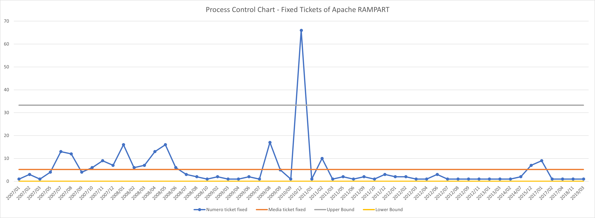

# RampartProcessControlChart
##### Deliverable 1 - ISW2 2020-2021

Il progetto consiste nel ricavare informazioni dalla piattaforma Jira per poter valutare la
stabilità del numero di ticket Jira risolti per il progetto Apache Ramport, attraverso un Process Control Chart.

---

> Dal grafico è possibile notare come il numero di fixed ticket 
> sono all'interno della media eccetto che nel mese di dicembre 2010, 
> durante il quale sono stati risolti ben 66 ticket. Questo è probabilmente dovuto al fatto che
> nel periodo precedente sono state implementate nuove feature che hanno introdotto un elevato 
> numero di bug. Un altro possibile motivo è che in quel mese il team di sviluppo abbia deciso di
> dedicarsi al fixing dei bug del progetto, per poterne migliorare la qualità. Il lower bound è stato 
> portato a 0 perché risulta essere un numero negativo, che per i ticket risolti non ha senso.
> Per raggruppare il numero di ticket per ogni mese è stata utilizzata la funzionalità Excel "Tabella Pivot".
> - Dal grafico sono stati esclusi i mesi che avevano un numero di ticket risolti pari a zero.
> - Sono stati esclusi anche tutti i mesi che non avevano almeno un git commit.
> - In media in ogni mese sono stati eseguiti circa 50 commit
> - In media in ogni mese sono stati risolti circa 5 tickets
> - In totale i git commit effettuati sono circa 8000, ma di questi solo il 5% ha nel messaggio almeno un ticketID. Questo significa che il 95% della storia dei commit e' persa e non e' utilizzabile per individuare la buggyness delle classi.
---

## Struttura del deliverable
La repository contiene un progetto Maven che include le dipendenze per JSON e le configurazioni per SonarCloud.
L'analisi di SonarCloud è stata impostata tramite github action e avviene a ogni commit/pull-request
Per il progetto SonarCloud collegato a questa repository cliccare [qui](https://sonarcloud.io/dashboard?id=redjack96_RampartProcessControlChart)

Sono inclusi nella repository
- il codice senza code-smells
- il csv ricavato a partire dall'output del progetto
- il file excel contenente il Process-Control-Chart dei fixed ticket per il progetto Apache Rampart

